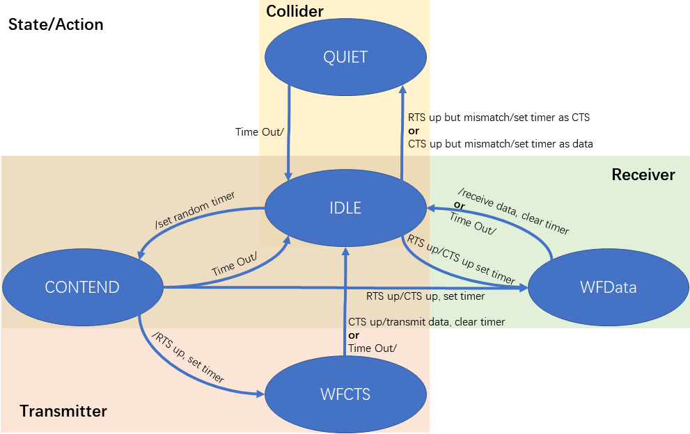
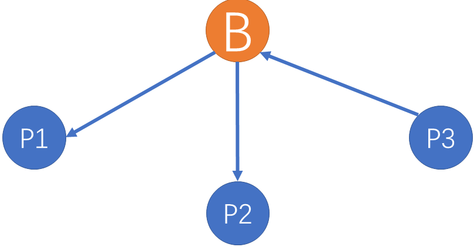
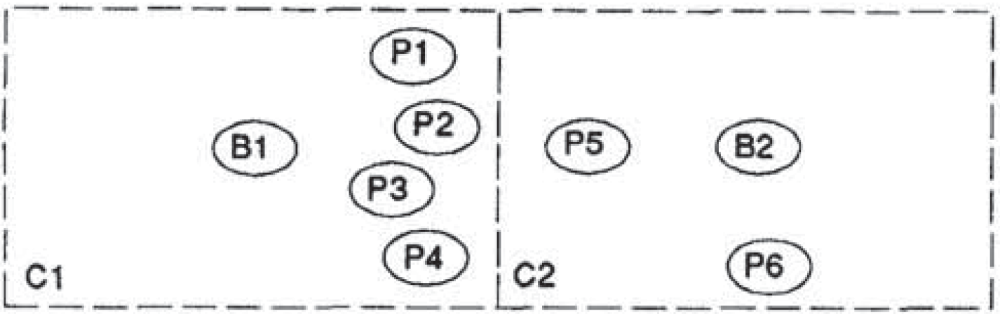
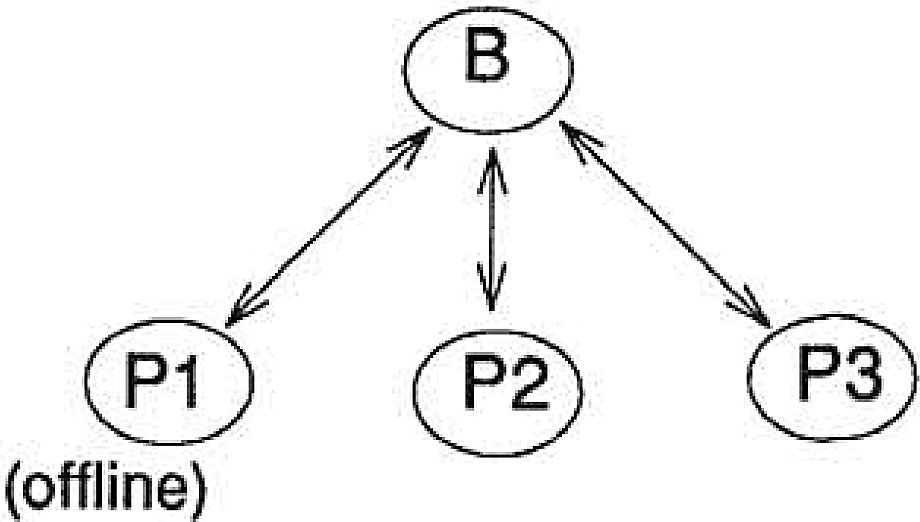
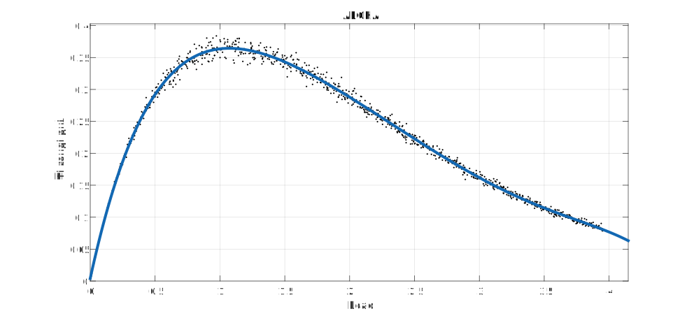
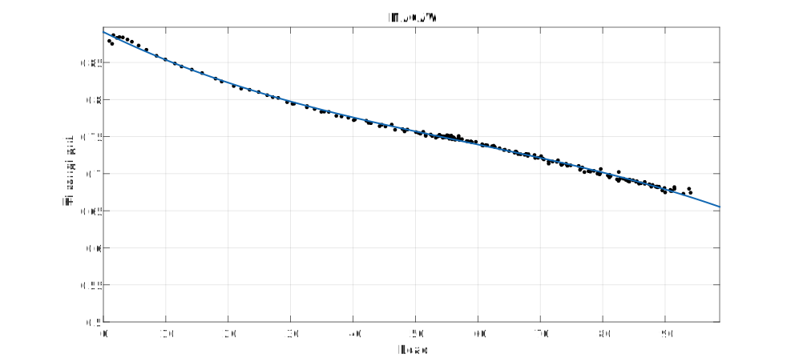
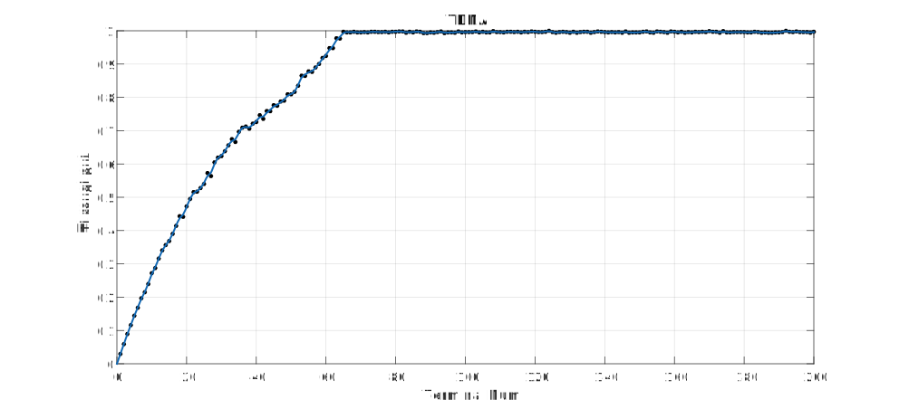

# [MACAW](https://wenku.baidu.com/view/f737c1ec5ef7ba0d4a733ba2.html?re=view "MACAW： A Media Access Protocol for Wireless LAN's") Report

## 1 背景
当组网中不只有一对数据传输，而是有多个终端共用网络时，如果不能进行合理的调度，彼此的传输很容易产生冲突。为了避免冲突，在包级传输中，提出了很多解决思路来处理这一情况。其中最为广泛而普适的思路即为载波侦听（CSMA)，基于CSMA，有很多扩展算法提出了更全面，更方便的解决冲突问题，MACAW就是其中的一个想法，具体介绍MACAW之前，我们需要先了解一些基础知识：CSMA和MACA。

### 1.1 CSMA
在CSMA算法中，每一个终端在进行发送之前会侦听当前网络中的载波状况。如果当前网络中可以检测到载波，那么终端将推迟本次传输。  
载波侦听通过检测发送机附近的载波信号强度来避免产生冲突。然而，我们需要注意的是，冲突不单单会在发送机产生，接收机当同时收到两个或者更多信号时，信号间的互相干扰也会产生冲突。因为发送机和接收机之间并不本地协同的，因此仅仅依靠载波侦听不能完全的避免冲突。两个典型的例子就是隐藏终端和暴露终端。

图中终端B可以同时侦听到A和C，但A和C彼此不能侦听到对方

>[隐藏终端(Hidden Terminal)](https://baike.baidu.com/item/%E9%9A%90%E8%97%8F%E7%BB%88%E7%AB%AF/7374010?fr=aladdin)  
>隐藏终端：在接收机的侦听范围内而在发送机的侦听范围外的终端  
>考虑A向B发送数据的场景，C为隐藏终端。当A向B发送数据时，C无法侦听到A的载波，因此会向B发送数据，从而使B收到信号互相干扰，产生冲突。

---

>[暴露终端(Exposed Terminal)](https://baike.baidu.com/item/%E9%9A%90%E8%97%8F%E7%BB%88%E7%AB%AF/7374010?fr=aladdin)  
>暴露终端：在发送机的侦听范围内而在接收机的侦听范围外的终端  
>考虑B向A发送数据的场景，C为暴露终端。当B向A发送数据时，C侦听到了B的载波，因此会产生延时，推迟发送。虽然A在C的侦听范围外，C的数据发送不会影响到A的数据接收，但由于B在发送数据导致C无法接收发向自己的数据包，从而无法接入信道。

由于CSMA只能在发送端避免冲突而无法保证接收端，所以当终端分布比较分散，彼此不完全在侦听范围内时，就会引入无法避免的冲突，或性能上的变差。因此，我们需要找到一个新的冲突避免策略。MACA作为另一个有效方法，得以发展。

### 1.2 MACA

MACA可以理解为一种协议，通过引入两个新的包(RTS&CTS)解决了接收端冲突避免的问题。

>**Request-to-Send(RTS)**: 发送请求  
>发送端发送，接收端接收。包含：发送端ID，接收端ID，请求字节数  
>**Clear-to-Send(CTS)**: 发送接受  
>接收端发送，发送端接收。包含：发送端ID，接收端ID，准许字节数
  
---

>基本传输流程(A向B发送数据)：  
>1. A发送RTS给B  
>2. B收到RTS，同时当前B不处在延时状态，B立即发送CTS给A  
>3. A收到CTS，立即开始数据传输  
>任何收到RTS的终端都产生一个CTS完成的时延；任何收到CTS的终端都产生一个准许字节数数据包完成的时延。

基于上述设计，我们考虑CSMA中无法解决的隐藏终端和暴露终端问题。  
隐藏终端：C无法收到A的RTS但是可以收到B的CTS，由规则，会产生一个数据包长度的时延，从而避免B端出现冲突。  
暴露终端：C可以收到B的RTS但是无法收到A的CTS，由规则，会产生一个CTS等待时延，从而避免了更长的数据传输时延。  
除此之外，每个终端都设置有计时器，用于避免丢包产生的影响。(如发送RTS后，等待CTS长时间无应答，将会产生Timeout)                                                                                                                                                                                                                                                                                                                                                                                                                                                                                                                                                                                                                                                                                                                                                                                                                                                                                          

MACA的状态转移图如下：

看起来似乎MACA已经完全解决了冲突问题？实际上不是的。下文中，我们会列举出MACA的一系列问题，正是对这些问题的思考，本文作者得出了MACAW的设计思路。

## 2 MACAW设计思路

MACAW的设计是以MACA为基础的，可以理解为MACA的升级版，这一章节将从几个角度来介绍MACAW对MACA的修改，来了解MACAW的设计思路，以及面对问题的处理方法。

### 2.1 回退算法

**改进一：扩展包头**
  
重传发生在发送端发送了RTS但没有收到对应RTS时会产生(WFCTS to IDLE with /Time Out)。   
MACA中，发送端根据BEB算法确定重传时间。

>[**BEB算法(Binary Exponential Backoff)**](https://baike.baidu.com/item/%E4%BA%8C%E8%BF%9B%E5%88%B6%E6%8C%87%E6%95%B0%E9%80%80%E9%81%BF%E7%AE%97%E6%B3%95/3405081?fr=aladdin)  
>成功传输后(RTS后收到CTS)回退计数器(Back Counter)数据变化： \\(F\_{dec}(BO)=BO\_{min}\\)    
>遇到冲突后(RTS后未收到CTS)回退计数器数据变化：\\( F\_{inc}(BO)=\min[2BO,BO\_{max}] \\)  
>遇到冲突时，用户根据自己的回退计数器的值BO从\\([0,2^{BO}]\\)中选择一个整数值，乘上基本时延(时隙长度)作为重传时间。

BEB算法可行，但很容易出现不平等现象。原文作者给出了这样一个场景来说明BEB的缺陷：  
设想这样一个场景，1个基站下有2个用户，两者同时向基站发出数据请求，若产生冲突，则会有1个用户收到冲突信息从而增长重传时间，另1个会成功传输，首先获得传输机会的用户根据BEB算法，回退计数器的值会置位BOmin，而收到冲突信息的用户会维持在一个很高的BO值。在大数据传输的场景下，每个用户几乎都有大量的数据需要发送，在BEB算法的情况下，一开始获得传输机会的用户将会一直传输(因为BO很小)，而一开始没有传输机会的用户将一直处于长等待状态。

原作者给出了上述例子的仿真结果，与预计相同，1个用户得到了比较大的传输吞吐量，而另1个为0。  
这种不平等的现象其实源于个体间信息的不对称：不同终端在本地保有BO值，而BO值的差异使得不平等现象的产生。解决方案是简单而直观的。在传输的数据包包头添加一个域包含当前BO值，这样当1个用户传输完成后，网络中所有有接入机会的终端的BO值都将降到很低，彼此拥有的接入机会相同，从而解决了不平等现象。

**改进二：MILD**  

将BO值添加进包头后，不平等现象得到了有效的解决，但经过仿真我们发现，在用户量比较大的场景里改进的BEB算法仍然会有一些问题导致网络的实际吞吐量不高(即网络利用率低)。  
我们设想一下这样的场景：有6个终端同时尝试接入，在他们尝试发送并成功完成接入时，BO值由于竞争以及变为一个比较大的值，这时当1个终端成功传输完成后，根据BEB算法所有终端的BO值将降为BOmin，然后开始新一轮的竞争，冲突，直到BO值重新增长为一个较高的值，这个BO值逐渐增长的过程其实是对网络吞吐量的浪费，造成这样的原因在于BEB算法对BO值的修改速度太“快”了，因此本文对BEB算法进行了修改，提出了MILD算法。

>**MILD算法(Multiplicative Increase and Linear Decrease)**  
>成功传输后(RTS后收到CTS)回退计数器(Back Counter)数据变化：\\(F\_{dec}(BO)=\max[BO-1, BO\_{min}]\\)  
>遇到冲突后(RTS后未收到CTS)回退计数器数据变化：\\(F\_{inc}(BO)=\min[1.5BO,BO\_{max}]\\)  
>遇到冲突时，用户根据自己的回退计数器的值BO从\\([0,2^{BO}]\\)中选择一个整数值，乘上基本时延(时隙长度)作为重传时间。

通过这样的变化，成功传输后的BO值只是减1，从而有效的避免了重新增长的问题，仿真验证这样的更改可以有效的提升网络的吞吐量。

**summary1：通过回退算法的修改，我们初步解决了MACA中的不平等现象，并提出MILD算法，提高了网络吞吐量。**

### 2.2 多流模型

让我们回到带宽平等分配的问题上，在最初的设计中，每个终端都保有一个回退计数器和一个先入先出数据队列(a single FIFO packet queue at each station with a single backoof parameter BO)，让我们考虑下图中的场景：

图中基站B向P1，P2发送数据，P3向基站发送数据。仿真中，每条数据流都是32packet/s，UDP传输

如图，当我们给每个终端平均分配带宽时，会出现终端到基站数据流占据了1/2的带宽，而两条基站到终端数据流各占用了1/4的带宽(仿真结果)。  
>考虑基站，在进行带宽分配时，由于只保有一个BO，P1和P2会产生竞争(contention)，所以最终成功传输时的BO值应该比P3-B对要高一倍，这就导致资源分配上会倾向于P3-B对，这也是2 : 1 : 1现象出现的理论解释。  

显然，当我们考虑平等时，上图中的三条流应该是均匀的，而不是现在的2 : 1 : 1。这就要求我们根据流(stream)做带宽分配，而不是根据终端进行分配。由此，本文提出了多流模型。  
多流模型其实思想很朴素：将每个终端的不同流考虑成彼此分割独立的多个队列，每个队列独自保有一个BO值。多个数据目标被称为本地合作(co-located)的，当准备发送数据时，根据每个队列的BO值大小，发送端以类似抛硬币的方式决定每个队列等待多长时间来发送RTS(IDLE到CONTEND的那个random timer设定)，之后，向random timer最短的那个流发送数据。如果最小的不止一个，就随机选一个而不是当做产生了一次冲突。  
基于上述设计，仿真结果表明可以有效的平衡各个数据队列。

**summary2：通过多流模型的建立，我们解决了单端多流的不平等问题。**

### 2.3 基本信息包的变换

为了更好的提高MACA模型的性能，我们在基本信息包的层面提出了四点改进(ACK,DS,RRTS and Multicast)，从而更好的提高MACA的性能。

### 2.3.1 ACK

MACA协议里，链路层不具备判断数据包是否成功传输的方法，当数据包传输是否成功只能通过传输层协议来保证，这种方式将导致重传时延变长，为了有效的解决这一问题，MACAW协议中提出了ACK(acknowledgment)包来解决这个问题。每次数据成功传输后，接收端向发送端发送一个ACK包来表明数据已正确传输。仿真表明，在考虑误码，数据包传输会出现错误时，ACK包的增加可以显著减缓性能衰减。

#### 2.3.2 DS

我们回顾一下暴露终端，由于暴露终端可以发送RTS，但无法接收CTS，根据MACA协议，在数据发送阶段，暴露终端是可以发送数据包的，但它发送的RTS没有应答，所以会不断地增长BO值。加入ACK包后，如果暴露终端仍然继续发送RTS，则有可能会干扰ACK而使得原发送端认为数据未正确发送。解决这个问题有两个方法：  
1. 载波侦听，等整个网络中无载波再重新传输(CSMA/CA)   
2. 增加DS包，发送端发送，告知其载波覆盖区各终端应该静默的延时(直到ACK正常接收)  

由于载波侦听需要网络完全空闲时才会考虑接入，所以很容易产生不平等现象，原文通过仿真证明DS包相对于载波侦听要有更好的平衡性，因此选用了DS包的方法。

#### 2.3.3 RRTS

考虑上述场景，B1、B2彼此不可见，但P1、P2彼此可见，在ACK包，DS包添加的情况下，假如B1-P1传输首先建立成功，那么P2将在DS包的作用下被沉默，B2由于在不停的发送RTS而没有被回复，BO值不断增加。当B1-P1传输完成后，其BO值相比B2的值要小很多，在高流量场景下，B1-P1会再次建立传输对，由于BO值小的优势，B2-P2传输对将无法获得传输机会，从而产生不平等现象。

对于此种场景，文中给出的解决方法是增加RRTS包。当P2被沉默但受到B2发送的RTS后，P2切换自身状态并且在沉默结束后立即向B2发送RRTS包，B2收到RRTS后不再进行重传等待而是立即发送RTS尝试建立连接。通过这种方式可以很好的平衡上述场景。文中通过仿真证明了这样是有效的。

#### 2.3.4 多播

文中含蓄的表示，MACAW协议在多播场景中其实并不好用。但还是给出了一个相对合理的多播场景的使用方法。即将多播转化为连续的单播，在完成第一个接收端的数据传输后立即发出第二个接收端的RTS，从而实现多播的效果。文章表示这样的思路与CSMA相同，也没有再给出更加具体的仿真或说明。

**summary3：通过增加基本信息包，MACAW相对于MACA确实在平等角度做出了很大的进步，但在介绍中也不难发现，很多包的设计其实是由于前一个包的增加会产生一些不能避免的问题。从侧面可以看出，以MACA作为基础模型的MACAW实际上是有比较大的瓶颈的。**

### 2.4 回退算法所无法解决的问题

经过上述的修改，MACAW相对于MACA已经有效的解决了很多问题，但对于如下问题，MACAW还无法给出很好的处理方法。

#### 2.4.1 非均匀网络的传染

如图，P1，P2，P3，P4，P5互相可以感知，C1，C2网络并不均匀。根据对回退算法的修改，BO值会扩散传播。但就像图中的场景，C1的负载更大，BO值会保持在一个较高的数值，C2的负载更小，所以BO值保持的会比较小，但中间可以彼此互相感知的一些终端会将BO值彼此交换，这就导致了：  
1. 当P5把C1中的高BO值引入C2，导致C2产生了不必要的长延时，降低吞吐量；  
2. 当P1、2、3、4把C2中的低BO值引入C1，导致C1需要再次经过竞争把BO值调高才能正常解决冲突问题，降低吞吐量。

#### 2.4.2 噪声和网络变化的感知

如图，基站依次向三个终端发送数据，当一段时间后，P1将离开组网，但基站无法感知，从而会认为RTS无回应，导致BO值不断提高，降低网络吞吐量。

**summary4：文中提出这些问题表明了MACAW的一些局限性，针对这样的问题，文中说可以在每个终端保有一个类似路由表的内容，将端到端的BO值彼此独立，而不是每个终端仅保留1个BO值。这样的设计本文在附录中给出了算法设计，但是并没有做很详细的分析。**

## 3 MACAW流程与状态

注：可参考WikiPedia-[Multiple Access with Collision Avoidance for Wireless](https://en.wikipedia.org/wiki/Multiple_Access_with_Collision_Avoidance_for_Wireless)

### 3.1 成功传输

**A到B的成功传输**：
  
1. Request To Send frame (RTS) from A to B  
2. Clear To Send frame (CTS) from B to A  
3. Data Sending frame (DS) from A to B  
4. DATA fragment frame from A to B  
5. Acknowledgement frame (ACK) from B to A
  
### 3.2 RRTS场景

**A到B传输时，D同时向C传输，C无法即使回复D从而需要RRTS：**
  
1. Request To Send frame (RTS) from D to C  
2. Request for Request to send frame (RRTS) from C to D  
3. Request To Send frame (RTS) from D to C  
4. Clear To Send frame (CTS) from C to D  
5. Data Sending frame (DS) from D to C  
6. DATA fragment frame from D to C  
7. Acknowledgement frame (ACK) from C to D

### 3.3 MACAW 状态转移图

**State/Action**:
  
C1: Receive the data done / send ACK, clear the timer  
C2: Receive RTS but ACK has done / send ACK  
C3: Receive ACK / clear the timer  
C4: Receive DS / set a timer  
C5: Receive RTS / send CTS, set a timer  
C6: Ready to transmit / set a random timer  
C7: TIME OUT and for receiver-initiated transmission / send RRTS  
C8: Receive RRTS / send RTS, set a timer  
C9: Receive CTS / clear the timer, send DS and Data, then set a timer  
C10: Receive RTS / send CTS, set a timer  
C11: TIME OUT and for sender-initiated  transmission / send RTS  
C12: Mismatch / set a corresponding timer  
C13: Receive RTS /  
C14: TIME OUT / set a random timer

## 4 MACAW的性能分析

这一章节主要是给出基于更新理论(Renewal Theory)的MACAW时延性能和吞吐量分析并给出仿真。

### 4.1 理论分析

采用[DBTMA](http://ieeexplore.ieee.org/document/1010617/)中类似的分析方式，我们设定参数如下：
  
- \\(\\tau \\) ~ one way propagation delay    
- \\(\\alpha \\) ~ RTS transmission delay  
- \\(\\beta \\) ~ CTS transmission delay  
- \\(\\gamma \\) ~ ACK transmission delay  
- \\(\\varepsilon \\) ~ DS transmission delay  
- \\(\\delta \\) ~ data transmission delay  
- \\(t\_c \\) ~ the value of random timer from IDLE to CONTEND

吞吐量: \\(S = \\frac{\\overline{U}}{\\overline{B} + \\overline{I}} \\)  
其中：
  
- \\(\\overline{U} \\)表示数据传输平均时长  
- \\(\\overline{B} \\)表示平均忙时(可以简单的理解为需要传数据的时间)  
- \\(\\overline{I} \\)表示平均闲时(可以理解为无需传数据的时间)
-   
将整个传输过程描述为强度为\\(\\lambda \\)的[泊松过程(Possion Process)](https://baike.baidu.com/item/%E6%B3%8A%E6%9D%BE%E8%BF%87%E7%A8%8B/9494478?fr=aladdin)，则我们可以得到以下结论：
  
1. RTS成功传输概率： \\(P\_{s} = e^{-\\lambda (t\_c + \\tau)} \\)  
2. 成功传输所需时长： \\(T\_s = t\_c + \\tau + \\alpha + \\tau + \\beta + \\tau + \\varepsilon + \\delta + \\tau + \\gamma +\\tau \\)  
整理得：\\(T\_s = t\_c + \\alpha + \\beta + \\gamma + \\varepsilon + \\delta + 5\\tau \\)  
[注：CONTEND等待延时+RTS传输延时+CTS传输延时+DS传输延时+data传输延时(无中间等待，共用一个单路延时)+ACK传输延时]  
3. 失败传输所需时长： \\(T\_f = \\frac{t\_c + \\tau + \\alpha + t\_c + \\tau}{2} \\)  
整理得： \\(T\_f = t\_c + \\tau + \\frac{\\alpha}{2} \\)  
4. 平均忙时： \\(\\overline{B} = P\_sT\_s + (1 - P\_s)T\_f \\)  
5. 平均闲时： \\(\\overline{I} = \\frac{1}{\\lambda} \\)  
6. 数据传输平均时长： \\(\\overline{U} = P\_s\\delta \\)  
7. 吞吐量： \\(S =  \\frac{P\_s\\delta}{P\_s(t\_c + \\alpha + \\beta + \\gamma + \\varepsilon + \\delta + 5\\tau)+(1 - P\_s)(t\_c + \\tau + \\frac{\\alpha}{2}) + \\frac{1}{\\lambda}}\\)

### 4.2 仿真

**仿真目标**：对比时隙ALOHA，MACAW和TDMA三种方式的性能差异

**仿真场景**：1个基站覆盖下，若干个设备向基站进行信息传输，随机发送时间以模拟一般发送场景以及冲突产生情况。

**参数设定**：
MACAW的BO值范围设定：

- BO_MIN = 2
- BO_MAX = 64

MACAW的包长设定：

- RTS_len = 1
- CTS_len = 1
- DS_len = 1
- DATA_len = 50
- ACK_len = 1
- TOTAL_len = RTS_len + CTS_len + DS_len + DATA_len +ACK_len

此处根据原文中的信令包长度为30Byte，数据包长度为1500Byte等比例换算得来。

**代码样例**：对于代码中实现功能的主要部分进行详细介绍

终端描述：

	class Terminal(object):
    	def __init__(self, protocol = 'ALOHA', BO = BO_MIN, time = random.randint(0, TIME_RANGE)):
	        #the protocol of the network
	        self.Prot = protocol
	        
	        #set of random timer
	        if(self.Prot == 'ALOHA'): #如果为ALOHA，设置随机时间跨度
	            self.Randtime = 1024
	            
	        elif(self.Prot == 'MACAW'): #如果是MACAW，设置初始BO值
	            self.BO = max(min(BO, BO_MAX), BO_MIN)
	            
	        elif(self.Prot == 'TDMA'): #如果为TDMA，设置随机时间跨度
	            self.Randtime = 64
	        else:
	            print('ERROR! No matched Protocol!')
	            exit(0)
	        
	        #set the transmission time
	        self.Time = time
    
	    def setBO(self, BO):
	        self.BO = max(min(BO, BO_MAX), BO_MIN)
	    
	    def setTime(self, time):
	        self.Time = time

网络构建：
	
	*******************ALOHA*******************
	if(self.Prot == 'ALOHA'):
		#start the simulation
		while(True):
        	#the number and index of collision terminals in one slot
            coll_num = 0
            coll_term = []
            #check every terminal
            for i in range(self.TermNum):
            	if(NetCell[i].Time >= count * SLOT and NetCell[i].Time < (count + 1) * SLOT):
                	coll_num += 1
                    total_pkt += 1
                    coll_term.append(i)
                else:
                    continue
            #time is going on
            count += 1
                
            if(coll_num == 0): #给定时刻没有数据包需要传输，则跳过这个slot
            	continue
            elif(coll_num == 1): #给定时刻只有一个终端需要传输，则不会出现冲突，成功传输
                succ_pkt += 1
				#完成传输的终端在接下来的随机时间内再次产生发送请求
                NetCell[coll_term[0]].setTime(random.randint(0, NetCell[coll_term[0]].Randtime) + count * SLOT)
                if(succ_pkt > SUCCESS_RANGE):
                    break
            else: #coll_num > 1 #发生了冲突，则发生冲突的每个终端在接下来的时间随机设定重发时间
                for i in range(coll_num):
                    NetCell[coll_term[i]].setTime(random.randint(0, NetCell[coll_term[i]].Randtime) + count * SLOT)

	*******************MACAW*******************
	elif(self.Prot == 'MACAW'):
		#data sending countdown
        DS_num = 0
        #start the simulation
        while(True):
        	#the number and index of collision terminals in one slot
            coll_num = 0
            coll_term = []
            #check network state
            if(DS_num == 0): #首先需要判断当前网络中是否有数据包在传输
                #check every terminal
                for i in range(self.TermNum):
                    if(NetCell[i].Time == count):
                        coll_num += 1
                        total_pkt += 1
                        coll_term.append(i)
                    else:
                        continue
                #time is going on
                count += 1

                if(coll_num == 0):
                    continue
                elif(coll_num == 1): #只有一个发送终端时，首先完成BO值的更新与广播，然后重新计算所有设备的发送时间
                    #LD of MILD
                    BO = NetCell[coll_term[0]].BO - 1
                    for i in range(self.TermNum):
                        #copy the BO to each terminal
                        NetCell[i].setBO(BO)
                        #calculate the transmission time for each terminal
                        NetCell[i].setTime(random.randint(0, 2**NetCell[i].BO) + count + TOTAL_len)
                    DS_num = TOTAL_len
                    succ_pkt += 1
                    if(succ_pkt > SUCCESS_RANGE):
                        break
                else:
                    for i in range(coll_num): #每个冲突终端独立进行MILD的乘性增加操作
                        #MI of MILD
                        NetCell[coll_term[i]].setBO(int(NetCell[coll_term[i]].BO * 1.5))
                        #calculate the retransmission time for each collision terminal
                        NetCell[coll_term[i]].setTime(random.randint(0, 2**NetCell[coll_term[i]].BO) + count)
                        
            else: #DS_num != 0 表示正在倒数，此时网络中有数据包在发送
                for i in range(self.TermNum):
                    if(NetCell[i].Time == count):
                        coll_num += 1
                        total_pkt += 1
                        coll_term.append(i)
                    else:
                        continue
                #make sure the collision has been avoided
                if(coll_num != 0):
                    print('ERROR! A COLLISION HAPPENED!')
                    quit(0)
                #time and countdown is going on
                count += 1
                DS_num -= 1
	*******************TDMA*******************
	while(True):
		#check the index of time slot
			index = count % self.TermNum

            #check each terminal
            for i in range(self.TermNum):
                if(NetCell[i].Time == count and i == index): #如果第i个终端在第i个时隙有传输请求，则发送
                    #success transmission
                    NetCell[i].setTime(random.randint(0, NetCell[i].Randtime) + count + 1)
                    succ_pkt += 1
                        
                elif(NetCell[i].Time == count and i != index): #若有传输请求但还未到对应时隙，则往后推延
                    #push to the next slot
                    NetCell[i].setTime(count + 1)
                    
                else:
                    continue
                    
            if(succ_pkt > SUCCESS_RANGE):
                break
                
            #time is going on
            count += 1

其他代码相关内容请直接参考具体代码。

**仿真流程**：
从一个较小的给定终端数量开始，逐渐增加单个基站覆盖下的终端数量，从而仿真不同业务压力下各个MAC协议的吞吐量性能，统计数据并进行画图分析。

**仿真结果**：
三种模式的仿真结果如图，由于性能范围差距较大，所以没有强行放在一张图片中呈现。

对比三种模式，我们可以发现随着终端数量(业务负载)的增大，产生冲突的可能性逐渐增大，MACAW的性能逐渐降低，但整体相比同种类型的时隙ALOHA，吞吐量还是产生了很大的提升。但与TDMA相比，在终端数量较大的场景，冲突避免协议相对于已经划定信道的调度方式，如TDMA这类协议还是会有比较大的劣势。

